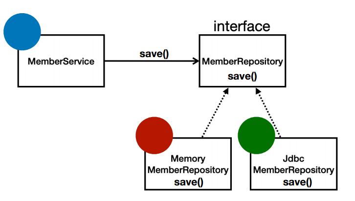

# 스프링의 핵심
- 스프링은 자바 언어 기반의 프레임워크인데, 자바 언어의 가장 큰 특징은 객체 지향 언어라는 점.
- 스프링은 객체 지향 언어가 가진 강력한 특징을 살려내는 프레임워크. -> 이는 좋은 객체 지향 애플리케이션을 개발할 수 있게 도와준다.

# 객체 지향 특징
- 추상화
- 캡슐화
- 상속
- **다형성**  

객체 지향 프로그래밍의 특징중 다형성이 스프링을 다룰 때 가장 핵심포인트

# 객체 지향 설계와 스프링
## 역할과 구현을 분리
- 역할과 구현으로 구분하면 세상이 단순해지고, 유연해지며 변경도 편리해진다.
- 장점
  - 클라이언트는 대상의 역할(인터페이스)만 알면 된다.
  - 클라이언트는 구현 대상의 내부 구조를 몰라도 된다.
  - 클라이언트는 구현 대상의 내부 구조가 변경되어도 영향을 받지 않는다.
  - 클라이언트는 구현 대상 자체를 변경해도 영향을 받지 않는다.

<br>



스프링과 객체지향 설계의 관계에서 다형성이 가장 중요함.
MemberRepository 인터페이스에게 상속받은 JdbcMemberRepository, JpaMemberRepository, MemoryMemberRepository 등
 여러 구현체를 클라이언트가 아무런 영향을 받지 않고도 구현체를 사용할 수 있음.


# 좋은 객체 지향 설계의 5가지 원칙 (SOLID)
- SRP: 단일 책임 원칙 (Single Responsibility Principle)
  - 한 클래스는 하나의 책임만 가져야 한다.
  - 하나의 책임이라는 것은 모호함 -> 클 수도 있고 작을 수도 있다. 또한 문맥과 상황에 따라 다름.
  - **중요한 기준은 변경**이다. 변경이 있을 때 파급 효과가 적으면 단일 책임 원칙을 잘 따른 것이라고 볼 수 있음.
  - ex) UI 변경, 객체의 생성과 사용을 분리
    - UI변경 같은 경우에는 UI만 변경 해야 하는데, 로직 내부의 코드가 변경이 되면 안됨.  


- OCP: 개방-폐쇄 원칙 (Open/Closed Principle)
  - 소프트웨어 요소는 **확장에는 열려** 있으나 **변경에는 닫혀** 있어야 한다.
  - **다형성**을 활용해보자
  - 인터페이스를 구현한 새로운 클래스를 하나 만들어서 새로운 기능을 구현
    - **OCP의 문제점**
      1. MemberService 클라이언트가 구현 클래스를 직접 선택 한다고 가정해보자.  
      2. MemberRepository m = new JdbcMemberRepository();  <- MemberService에서 JdbcMemberRepository를 사용하고있는데, Jpa로 변경을 원한다.
      3. MemberRepository m = new JpaMemberRepository(); <- jpa를 사용하기 위해 위의 Jdbc는 주석처리하고 jpa레포지토리 코드를 한 줄 더 적음으로써 변경이 일어난다.  
      4. 분명 다형성을 사용했지만 이로인해 OCP 원칙을 지킬 수 없게 됨. 왜 ? -> OCP는 변경에는 닫혀 있어야 함.  
      5.   이를 Spring Container가 해결 해줌.  


- LSP: 리스코프 치환 원칙 (Liskov Substitution Principle)
  - 프로그램의 객체는 프로그램의 정확성을 깨뜨리지 않으면서 하위 타입의 인스턴스로 바꿀 수 있어야 함.  
  - 다형성에서 하위 클래스는 인터페이스 규약을 다 지켜야 한다는 것, 다형성을 지원하기 위한 원칙, 인터페이스를 구현한 구현체는 믿고 사용하려면, 이 원칙이 필요하다.  
  - 단순히 컴파일에 성공하는 것을 넘어서는 이야기임.
  - ex) 자동차 인터페이스의 엑셀은 앞으로 가라는 기능으로 정의해놓고, 뒤로 가게 구현하면 LSP 위반, 느리더라도 앞으로 가야만 한다.  


- ISP: 인터페이스 분리 원칙 (Interface Segregation Principle)
  - 특정 클라이언트를 위한 인터페이스 여러 개가 범용 인터페이스 하나보다 낫다.
  - 자동차 인터페이스 -> 운전 인터페이스, 정비 인터페이스 등으로 분리 (기능별로)
  - 사용자 클라이언트 -> 운전자 클라이언트, 정비사 클라이언트로 분리
  - 분리하면 정비 인터페이스 자체가 변해도 운전자 클라이언트에 영향을 주지 않는다.
  - 인터페이스가 명확해지고 대체 가능성이 높아짐.  

- DIP: 의존관계 역전 원칙 (Dependency Inversion Principle)
  - 프로그래머는 "추상화에 의존해야지, 구체화에 의존하면 안된다." 의존성 주입은 이 원칙을 따르는 방법 중 하나다.
  - 쉽게 이야기해서 구현 클래스에 의존하지 말고, 인터페이스에 의존 하라는 뜻
  - 역할에 의존하게 해야 한다는것과 같음. 객체 세상도 클라이언트가 인터페이스에 의존해야 유연하게 구현체를 변경 할 수있다. 구현체에 의존하게 되면 변경이 매우 어려워짐.
    - **DIP의 문제점**
    - OCP에서 설명한 MemberService는 인터페이스에 의존하지만, 구현 클래스도 동시에 의존함.  
    - ex) MemberRepository(인터페이스) m = new JpaMemberRepository();(구현 클래스) <- 이와 같이 MemberService 클라이언트가 구현 클래스를 직접 선택한다.
    - 이는 DIP 원칙 위반이다.

# 정리
- 객체 지향의 핵심은 다형성  
- 다형성 만으로는 쉽게 부품을 갈아 끼우듯이 개발할 수 없음.
- 다형성 만으로는 구현 객체를 변경할 때 클라이언트 코드도 함께 변경된다.
- 다형성 만으로는 OCP, DIP 원칙을 지킬 수 없음.
- 뭔가 더 필요하다.


---


# OCP, DIP 원칙 위반을 벗어나는 설계법

객체 지향 설계의 5가지 원칙중 OCP (개방-폐쇄 원칙)와 DIP (의존관계 역전 원칙)을 위반하는 설계법을 극복하는 방법을 알아보자.

먼저 OCP는 확장에는 열려 있어야 하고, 변경에는 닫혀있어야 한다.

DIP는 구현체에 의존해서는 안되고, 추상체에만 의존을 해야 한다.

이를 스프링 프레임워크를 사용 하지 않은 순수 자바 코드로 살펴보자.

```java
public class OrderServiceImpl implements OrderService {

    private final MemberRepository memberRepository = new MemoryMemberRepository();
    //private final DiscountPolicy discountPolicy = new FixDiscountPolicy();
    private final DiscountPolicy discountPolicy = new RateDiscountPolicy();

    @Override
    public Order createOrder(Long memberId, String itemName, int itemPrice) {
        Member member = memberRepository.findById(memberId);
        int discountPrice = discountPolicy.discount(member, itemPrice);

        return new Order(memberId, itemName, itemPrice, discountPrice);
    }
}
```

순서도로 알아보자면

1. 고정된 금액으로 할인 받는 기능을 사용하기 위해 DiscountPolicy 인터페이스의 new 키워드를 통해 구현 클래스(FixDiscountPolicy)를 생성했다.(주석 부분) ← 추상체에만 의존을 해야 하는데, 구현체가 같이 있다. 이는 **DIP 위반**이다.
  1. 참고로 주석 처리 한 이유는 OCP 원칙 위반의 사례를 보여주기 위해 다른 구현 클래스로 변경 하면서 주석 처리 했음.
2. 고정된 금액으로 할인 받는 정책에서 → 고정된 퍼센트 ex)10% 로 할인 받는 정책으로 변경 하기 위해 위의 FixDiscountPolicy를 주석 처리를 하여금 지우고 밑에줄에 new RateDiscountPolicy를 추가 해주었다. → OCP 원칙은 변경에는 닫혀있어야 한다고 했다. → 이는 **OCP 위반**이다.

그럼 도대체 OCP와 DIP를 위반하지 않고 **추상체에만 의존**하면서, 또 **클라이언트 코드를 변경 하지 않고** 다른 기능을 쓰려면 어떻게 해야 할까?

```java
public class OrderServiceImpl implements OrderService {

    private final MemberRepository memberRepository = new MemoryMemberRepository();
    //private final DiscountPolicy discountPolicy = new FixDiscountPolicy();
    //private final DiscountPolicy discountPolicy = new RateDiscountPolicy();
		private DiscountPolicy discountPolicy; // 인터페이스에만 의존

    @Override
    public Order createOrder(Long memberId, String itemName, int itemPrice) {
        Member member = memberRepository.findById(memberId);
        int discountPrice = discountPolicy.discount(member, itemPrice);

        return new Order(memberId, itemName, itemPrice, discountPrice);
    }
}
```

위와 같이 모두 지우고 인터페이스만 의존한다.

→ 근데 이렇게 하면 구현체가 없는데 어떻게 코드를 실행할 수 있을까? (저 상태로 실행하면 당연스럽게도 NPE가 발생함)

**해결 방안**

이 문제를 해결하려면 누군가가 클라이언트인 OrderServiceImpl에 DiscountPolicy의 구현 객체를 대신 생성하고 주입 해주어야 한다.


```java
public class MemberServiceImpl implements MemberService {

    private final MemberRepository memberRepository;

    public MemberServiceImpl(MemberRepository memberRepository) {
        this.memberRepository = memberRepository;
    }

    @Override
    public void join(Member member) {
        memberRepository.save(member);
    }

    @Override
    public Member findMember(Long memberId) {
        return memberRepository.findById(memberId);
    }
}
```
```java
public class OrderServiceImpl implements OrderService {

    private final MemberRepository memberRepository;
    private final DiscountPolicy discountPolicy;

    public OrderServiceImpl(MemberRepository memberRepository, DiscountPolicy discountPolicy) { // 2번
        this.memberRepository = memberRepository;
        this.discountPolicy = discountPolicy;
    }

    @Override
    public Order createOrder(Long memberId, String itemName, int itemPrice) {
        Member member = memberRepository.findById(memberId);
        int discountPrice = discountPolicy.discount(member, itemPrice);

        return new Order(memberId, itemName, itemPrice, discountPrice);
    }
}
```

MemberServiceImpl에서 DIP 원칙 위반을 벗어나기 위해 new 키워드를 통한 구현체 인스턴스 생성을 없애고 인터페이스에만 의존하고 있다.  
-> 이제 구현체를 어디서 생성하느냐 인데, 이는 프로젝트의 전체 설정을 하는 Config 클래스를 만들고 그 안에서 한다. (애플리케이션 실제 동작에 필요한 **구현 객체를 생성**한다)  
  
아래와 같이 Config 클래스를 설정하기 전에 구현 클래스에서 먼저 위의 코드와 같이 생성자를 만들어 주어야 한다.  
그리고 OrderServiceImpl은 MemberRepository와 DiscountRepository 두개를 사용하기 때문에 2개의 구현 클래스를 리턴한다.

```java
public class AppConfig {

    public MemberService memberService() {
        return new MemberServiceImpl(new MemoryMemberRepository()); 
    }

    public OrderService orderService() {
        return new OrderServiceImpl(new MemoryMemberRepository(), new FixDiscountPolicy()); // 1번
    }

}
```

AppConfig는 생성한 객체 인스턴스의 참조(레퍼런스)를 생성자를 통해서 주입 해준다.  
-> 이게 무슨 말인가 하면, OrderServiceImpl을 예로 들어보면 위의 AppConfig에서 1번에 new 키워드를 통해 두개의 객체를 생성 한다.  
-> 그리고 AppConfig의 orderService()를 통해 생성된 객체가 OrderServiceImpl의 2번에서  생성자의 인자값에 들어가는 것이다.
이렇게 생성자를 통해서 주입을 하기 때문에, **생성자 주입**이라고 한다.  
위와 같이 생성자 주입을 통해서 객체를 만들기 때문에 인터페이스에만 의존하게 되어 DIP 원칙을 지킬 수 있다.  
  
### 정리
- MemberServiceImpl 입장에서 생성자를 통해 어떤 구현 객체가 주입될지는 알 수 없다.
- MemberServiceImpl 의 생성자를 통해서 어떤 구현 객체를 주입할지는 오직 외부(AppConfing)에서 결정된다.
- MemberServiceImpl 은 이제부터 **의존관계에 대한 고민은 외부**에 맡기고 **실행에만 집중**하면 된다. 


